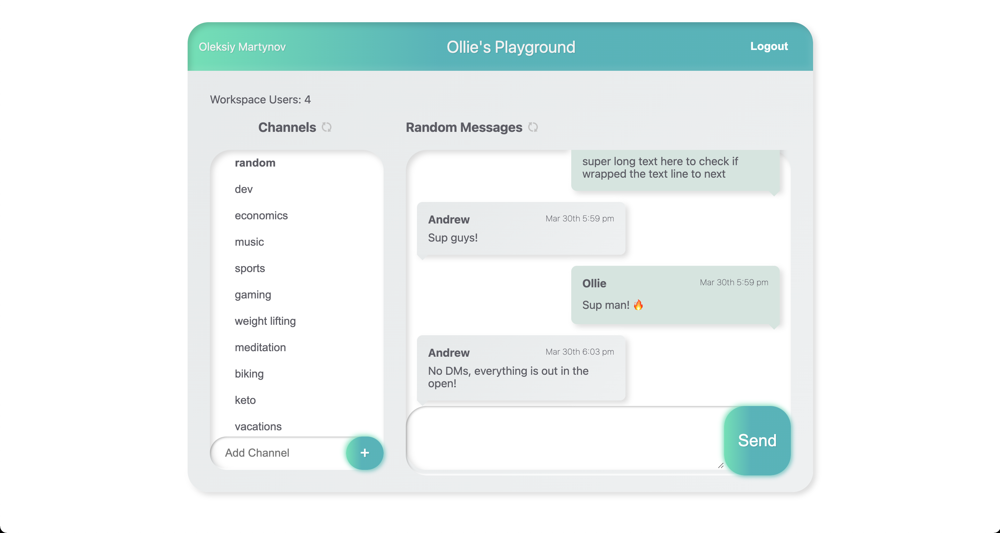

The purpose of this porject is to showcase the utility of the following tools/frameworks: NextJS, ReactJS, GraphQL, MongoDB, Netlify Functions (serverless), Netlify Identity (auth). You can test out the deployed project [here](https://tiny-slack.netlify.app/).



This is a [Next.js](https://nextjs.org/) project bootstrapped with [`create-next-app`](https://github.com/vercel/next.js/tree/canary/packages/create-next-app).


## Deploy locally with Netlify

First, install `netlify` cli tool.

Finally run the dev server with:

```bash
netlify dev
```

Your front end will be available on [http://localhost:8888/](http://localhost:8888/)

## Environment variables

Remember to set ``MONGO_DB_URL`` when building.


